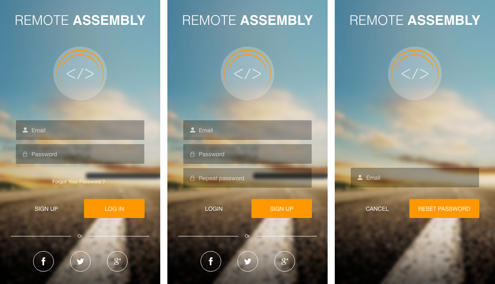

# What is it?

This documentation technique allows you to:

- describe all possible scenarios that can happen in a given screen or script without language- or platform- specific syntax
- express complex concepts using a compact, terse syntax
- keep it under version control
- create new features or changes descriptions as easily as changing few lines and pushing it to repo
- describe the very top level of business logic as well as low level interactions within the code itself
- accurately communicate with non-technically-educated people about
- interconnect multiple instances of the code Flowdocs

# How it works

Let's say we have a mobile app, that is connected to api server. In the given case our goal is to describe authentication process.


# Usage example

## 1. Artboards

Use artboards to describe visual look of the given UI


Use intercatives to describe animations with [Framer](https://framer.com/), for example.

***

## 2. Client side docs

**Syntax for client side**

```
|  - scene
>  - action
/  - initial state
=  - result
?  - if else statement
~  - request to server
```

**Scenes:**  
> Each scene described separetely from each other. Description assumes that reader is looking at the related artboard.

### Login
```
/ "Login" button is disabled until "email" and "password" inputs are filled
> Enter email and password; tap "LOG IN"
  ? email is malformed
    = snackbar message "Email is malformed"
  ? password is incorrect
    = snackbar message "Incorrect password"
  ? else
    = show loading indicator
    ~ signIn
> tap "Forgot Your Password?"
  | PasswordRecovery
> tap social authentication buttons
  ~ socialAuth
```

### PasswordRecovery
```
/ "RESET PASSWORD" button disabled until email input filled
> enter email, tap "RESET PASSWORD"
  ~ recoverPassword
> tap "CANCEL"
  | SignIn
```

### SignUp
```
/ "SIGN UP" button disabled until "email" and "password" inputs are filled
> Enter email and password; tap "SIGN UP"
  ? email malformed
    = snackbar message "Email is malformed"
  ? password incorrect
    = snackbar message "Incorrect password"
  ? else
    = show loading indicator
    ~ signUp
> tap "Forgot password"
  | PasswordRecovery
> tap social authentication buttons
  ~ socialAuth
```

***

## 2. Server side docs

**Server side syntax:**
```
$  - function, that can be induced only by server
?  - if/else statement
{} - incoming data
=  - result
~  - response/call to client
```

**Api methods:**  

> In this example i'm using only Api methods descriptions for sake of simplisity, but feel free to adopt the same approach for different cases.

### signIn
```
{
  email,
  password,
}
? email invalid
  ~ snackbar message "Email is invalid"
? password invalid
  ~ snackbar message "Password is invalid"
? else
  = find user by email in database
    ? user not found
      ~ snackbar message "Email not found"
    ? password incorrect
      ~ snackbar message "Email not found"
    ? else
      $ openUserSession
```

### openUserSession
```
...
```

### signUp
```
{
  email,
  password,
}
? email invalid
  ~ snackbar message "Email is invalid"
? password invalid
  ~ snackbar message "Password is invalid"
? else
  = find user by email in database
    ? user found
      ~ snackbar message "User with this email already exists"
    ? else
      $ createNewUser
```

### createNewUser
```
...
```

***
